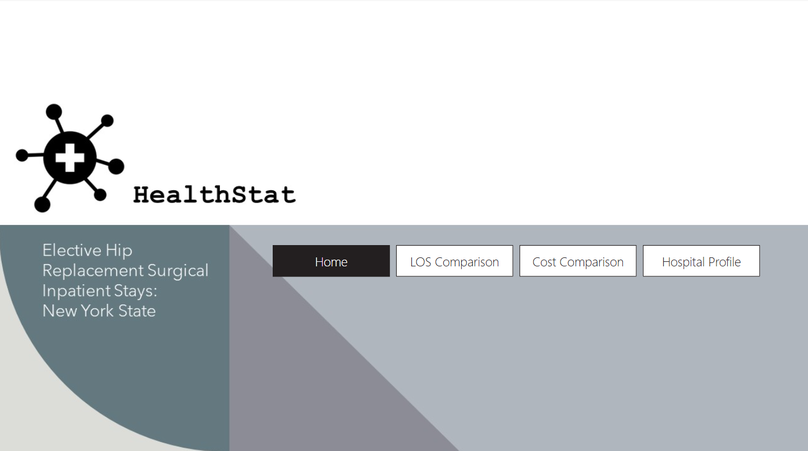
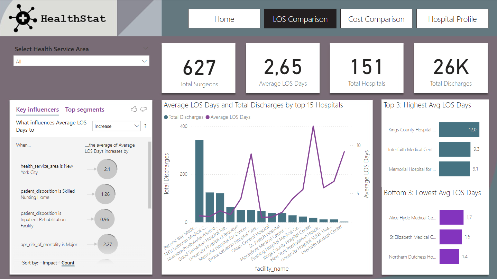
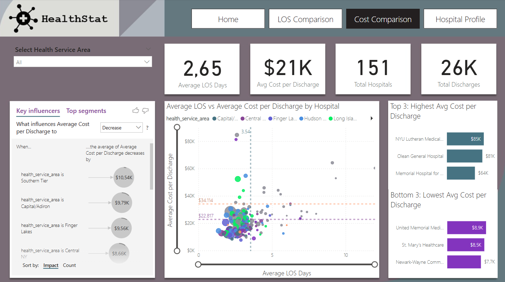
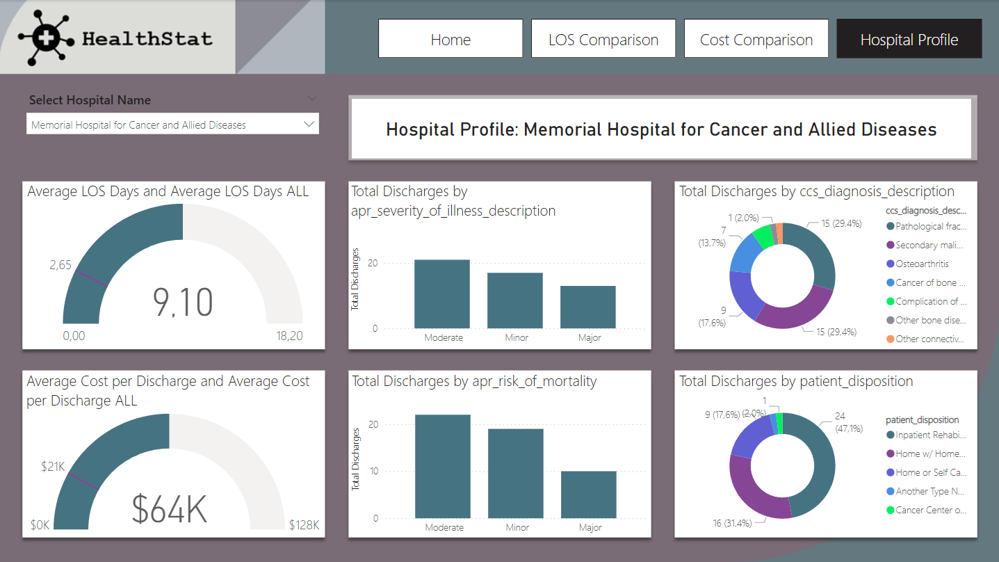

# 📊 Healthcare Efficiency Dashboard in Power BI

This repository presents a Power BI data visualization project focused on hospital efficiency, created based on the guidelines and case study proposed in the **DataCamp** course *"Analyzing Healthcare Data in Power BI"*, led by Lyndsay Girard, a Healthcare Analytics Consultant.

---

## 💡 Project Objective

Apply data modeling, visual exploration, DAX formulas, and report design skills to:

- Assess **hospital efficiency** based on Length of Stay (LOS) and Average Cost per Discharge.  
- Identify hospitals with efficiency outliers.  
- Perform root cause analysis to understand the main factors affecting LOS and cost.

---

## 🛠️ Development Process

Following the course structure, I developed two dashboards as part of the analytical workflow:

### 🧪 1. Exploratory Dashboard

This intermediate dashboard helped me analyze raw data and identify key variables and patterns to prioritize.

📸 *Exploratory Dashboard:*

---

### 📊 2. Final Dashboard

📽️ *Dashboard in Action:*

The final product presents a refined layout with interactive visuals, benchmarks, and key insights.

📸 *Home Screen:*

📸 *Length of Stay (LOS) Comparison:*

📸 *Cost Comparison View:*

📸 *Hospital Profile View:*

---

## 🗂️ Dataset Overview

- Anonymized hospital discharge data from **2016**, for New York State.  
- Focus on patients who underwent **elective hip replacement surgery**.  
- **151 hospitals**  
- **26,286 discharges**  
- 30 columns with attributes such as:
  - `length_of_stay`, `total_costs`, `age_group`  
  - `facility_id`, `apr_severity_of_illness_description`, `apr_risk_of_mortality`, etc.

---

## 🧠 Key Insights

- Average cost per discharge: **$20,910**
- Main factors associated with higher costs and LOS:
  - Extreme illness severity
  - High risk of mortality
  - Hospitals located in New York City
  - Patient disposition to skilled nursing homes

---

## 📈 Dashboard Features

- Comparative view across hospitals  
- Highlight of outliers and major variances  
- Interactive metrics with filters by region, facility, severity, and risk  
- Guided navigation to facilitate understanding and strategic decision-making

---

## 🔧 Tools & Technologies

- Power BI Desktop  
- DAX (Data Analysis Expressions)  
- Tabular modeling and data cleaning

---

## 📎 Reference

Course available at: **[DataCamp]([https://www.datacamp.com/](https://app.datacamp.com/learn/courses/case-study-analyzing-healthcare-data-in-power-bi))**  
*"Analyzing Healthcare Data in Power BI"* – Lyndsay Girard, Healthcare Analytics Consultant.
